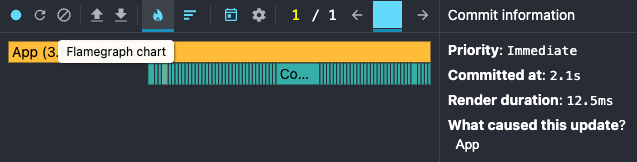
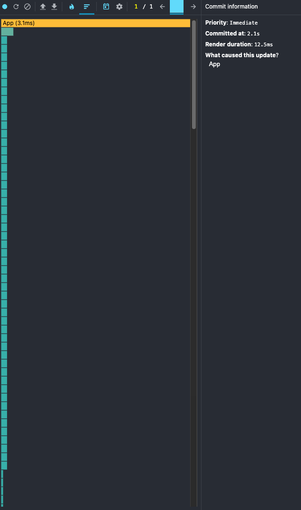
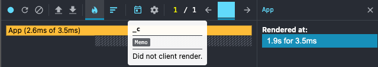
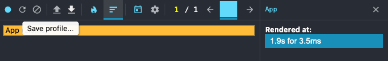

# Performance Profiling Task

## Initial Profiling with React Dev Tools Profiler

- **Commit Duration**: 2.1s
- **Render Duration**: 2.1s for 12.5ms was spent rendering the `App` component. Render of each CountryCrad took about 0.1-0.2ms
- **Interactions**: The performance was measured by choosing the sort by population
- **Flame Graph**: 
- **Ranked Chart**: 

## Update the App with React.memo and useMemo

- **Commit Duration**: 1.9s
- **Render Duration**: 1.9s for 3.5ms
- **Interactions**: The performance was measured by choosing the sort by population
- **Flame Graph**: 
- **Ranked Chart**: 

### Conclusion

After optimization the App with useMemo, React.memo the time of render decreased mainly because CountryCards (children) were not rerendered

